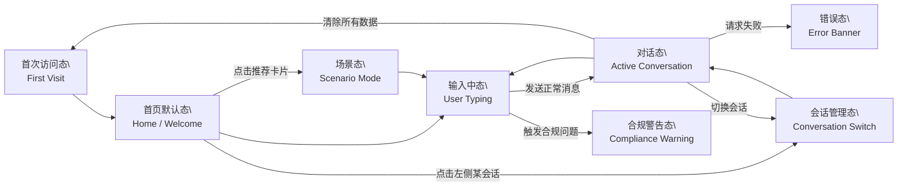

# UX Flow & Interaction States（PoC v0.1）

本文档定义「港股市场信息助手」PoC 的前端用户体验结构（UX）、页面状态（States），
以及关键操作的系统行为（Interaction Flows）。该文档作为前端开发、设计验证循环、
Prompt-to-UI 生成流程的一致性基准。

> 版本：PoC v0.1  
> 范围：单页应用（HKMarketChat），含 1 个页面 + 8 类核心操作态

---

## 1. 页面结构概览（单页应用）

本 PoC 目前只包含 **一个主页面：ChatHome（首页）**，由 `HKMarketChat` 负责渲染。
不采用多路由、多页面结构，而是在同一页面内通过多种状态切换实现完整体验。

页面主要区域划分：

1. **顶部栏（Header）**
   - 左侧：预留产品 Logo / 名称区域
   - 右侧：设置入口图标、用户头像（点击打开访客资料弹窗）

2. **左侧侧边栏（Sidebar）**
   - 会话列表（历史对话）
   - 「新建对话」按钮
   - （可选）会话搜索框

3. **主内容区（Main Content）**
   - 欢迎区（Welcome Section）  
     - 产品名称「港股市场信息助手」
     - 一句简短介绍文案
     - 推荐功能卡片（如：选股票 / 诊股票 / 看宏观 / 看大势 / 读新闻 / 查数据）
   - 对话区（Conversation Area）  
     - 用户消息气泡
     - 助手消息气泡
     - 结构化结果卡片（市场、财务、风险提示等）

4. **底部输入区（Input Area）**
   - 文本输入框（支持多行）
   - 发送按钮
   - （可选）快捷操作入口

5. **弹窗层（Modals）**
   - 首次访客引导弹窗
   - 访客资料弹窗（头像、昵称、访客 ID、加入时间）

---

## 2. 全局核心状态（Global States）

前端逻辑中，预期管理以下核心状态（变量命名仅供参考）：

- `guestInfo`：访客信息  
  - 结构示例：`{ guestId, nickname, joinDate }`
  - 存储位置：`localStorage` + 内存
- `activeConversationId`：当前会话 ID  
  - 用于从会话列表切换当前对话
- `messages`：当前会话的消息列表  
  - 包含用户消息与助手消息
- `scenarioKey`：当前选中的业务场景（增强态用）  
  - 例如：`"pick-stock"`, `"market-overview"`
- `complianceMessage`：合规提示信息  
  - 有内容时在对话区顶部显示黄色警示条
- `errorMessage`：通用错误信息（请求失败等）  
  - 有内容时显示红色 / 灰色错误提示条
- `isLoading`：当前是否正在等待助手回复  
  - 控制 Loading 提示、禁用输入等

---

## 3. 基础 6 态（Base States）

### 3.1 状态一：首次访问态（First Visit / Visitor Init）

**触发条件：**

- `localStorage` 中不存在 `guestInfo`（首次访问或已清除数据）
- 或主动清空访客信息后重新进入

**界面表现：**

- 页面加载后立即显示「访客引导弹窗」
- 背景为首页主界面，但被遮罩层覆盖（只可操作弹窗）

**典型交互：**

- 用户输入昵称（可选）
- 系统生成 `guestId`（例如 `GUEST-xxxxxx`）
- 记录 `joinDate`（首次访问时间）
- 点「开始使用」按钮 → 关闭弹窗 → 进入首页默认态

---

### 3.2 状态二：首页默认态（Home / Welcome State）

**触发条件：**

- 已有 `guestInfo`，但当前无激活会话  
  - 例如首次进入或新建会话、消息列表为空

**界面表现：**

- 中间展示：
  - 产品名称「港股市场信息助手」
  - 简要说明文案（产品定位、不会提供投资建议等）
  - 若干推荐功能卡片（选股票 / 诊股票 / 看宏观 / 看大势 / 读新闻 / 查数据）
- 底部输入区可用，允许直接提问
- 左侧侧边栏显示会话列表（可能为空或仅一条默认会话）

**典型交互：**

- 点击任意推荐卡片：
  - 输入框自动填入示例问题，或
  - 直接触发场景（见增强态：场景模式）
- 用户也可直接在输入框中输入问题并发送

---

### 3.3 状态三：输入中态（User Typing）

**触发条件：**

- 用户点击输入框，并开始输入字符

**界面表现：**

- 输入框高亮
- 发送按钮处于可点击状态
- 若输入内容为空，则发送按钮禁用（防止空消息）

**典型交互与规则：**

- 按 Enter（或点击发送）触发发送逻辑：
  - 若输入为空 → 不发送
  - 若合规性检测未通过 → 阻断发送，进入「合规警告态」
  - 若输入正常 → 进入「对话态」

---

### 3.4 状态四：对话态（Active Conversation）

**触发条件：**

- 用户完成一次有效发送，并收到至少一条历史消息或机器回复

**界面表现：**

- 对话区展示消息列表：
  - 用户消息气泡（右侧）
  - 助手消息气泡（左侧）
- 如有结构化回答：在助手消息中嵌入结构化卡片（行情、财务、风险提示等）
- `messages` 根据 `activeConversationId` 不同而切换

**典型交互与行为：**

- 发送新问题 → 新增一条用户消息气泡
- 助手回复：
  - 可以是纯文本
  - 或文本 + 一组数据卡片
- 对话区在新消息到达时自动滚动到底部
- 用户可以继续多轮对话

---

### 3.5 状态五：错误态（Error Banner）

**触发条件：**

- 与后端 / mock API 通信失败
- 返回错误状态码或异常抛出

**界面表现：**

- 在对话区顶部或输入区上方显示错误提示条，例如：
  - 「获取数据失败，请稍后再试」
- 可带有一个简单的「重试」按钮（可选）

**行为与规则：**

- 错误信息来自 `errorMessage`
- 再次发送消息或点击重试时可清除错误状态
- 不影响已存在的历史消息展示

---

### 3.6 状态六：合规警告态（Compliance Warning）

**触发条件：**

- 合规检查逻辑识别到当前输入包含敏感内容或不符合规则  
  （例如：显性投资建议、违法内容等）

**界面表现：**

- 在输入区上方显示黄色警示条，例如：
  - 「当前问题包含敏感内容，请重新描述。」
- 当前消息不会发送到后端

**行为与规则：**

- 用户需修改输入内容后才能重新尝试发送
- 清空输入或修改后，警告可自动消失或由系统重置

---

## 4. 增强 2 态（Enhanced States）

### 4.1 状态七：场景态（Scenario Mode）

**触发条件：**

- 用户点击首页推荐卡片（如「看大势」/「选股票」/「看宏观」等）
- 或内部逻辑为当前对话设置了特定 `scenarioKey`

**界面表现：**

- 输入框中填入与场景相关的预设问题（可编辑）
- 内部状态中记录 `scenarioKey`，例如：
  - `scenarioKey = "market-overview"`（看大势）
  - `scenarioKey = "stock-diagnose"`（诊股票）
- UI 可选：在输入区上方显示当前场景标签（Tag）

**行为与规则：**

- 发送消息时会将 `scenarioKey` 作为参数一同传给后端 / 工作流
- 用户若手动清除场景（例如点击“清除场景”按钮）：
  - 将 `scenarioKey` 置空
  - 页面回到普通对话态，不再对该会话应用特定场景逻辑

> 注：PoC v0.1 阶段，可以只在输入框中体现场景效果，不强制在 UI 中长期显示「当前场景 / 清除」条，避免干扰布局。

---

### 4.2 状态八：会话管理态（Conversation Management）

**触发条件：**

- 用户通过侧边栏：
  - 点击某个会话条目，或
  - 点击「新建对话」按钮

**界面表现：**

- 当前激活会话（`activeConversationId`）在侧边栏高亮
- 主对话区展示对应会话的消息列表
- 新建对话时：
  - 为当前会话分配新的 `conversationId`
  - 对话区为空 → 进入「首页默认态」或「空对话态」

**典型交互与行为：**

- 点击已有会话：
  - 更新 `activeConversationId`
  - 重新加载该会话的 `messages`
- 点击新建对话：
  - 创建新的会话记录（前端或后端）
  - 清空当前 `messages` 展示
  - 进入欢迎/空对话视图

---

## 5. 状态切换示意图（State Flow Diagram）

以下为常规用户路径的状态流示意（简化版）：

上图为逻辑模型，并非屏幕跳转。所有状态都发生在同一个页面内，由不同 UI 片段的显隐组合而成。

## 6. 行为表（Action → System Response）

| 用户动作 | 前置状态 | 系统行为 / 状态变化 |
| --- | --- | --- |
| 首次打开页面 | 无访客信息 | 进入「首次访问态」，展示访客引导弹窗 |
| 在访客弹窗输入昵称并确认 | 首次访问态 | 生成 guestId、记录 joinDate，保存 guestInfo，进入首页默认态 |
| 点击推荐卡片（如「看大势」） | 首页默认态 | 设置 scenarioKey，填入示例问题，进入「场景态」/ 输入中态 |
| 在输入框输入并发送消息 | 输入中态 | 合规校验通过 → 进入对话态，更新 messages、显示 Loading |
| 输入消息触发合规问题 | 输入中态 | 阻断发送，设置 complianceMessage，进入「合规警告态」 |
| 后端 / mock 接口请求失败 | 对话态 / 发送请求中 | 设置 errorMessage，显示错误提示条，保持当前对话内容 |
| 点击左侧会话列表中的某条会话 | 任意态 | 更新 activeConversationId，加载该会话 messages，进入对话态 |
| 点击「新建对话」 | 任意态 | 创建新会话，设置新的 activeConversationId，显示空对话 / 欢迎界面 |
| 点击「清除所有数据」 | 任意态 | 清空访客信息与会话信息，刷新后回到「首次访问态」 |

本文件会随着 PoC 迭代持续更新，当页面布局、组件命名或状态管理逻辑有重大调整时，应同步修订本文件。
